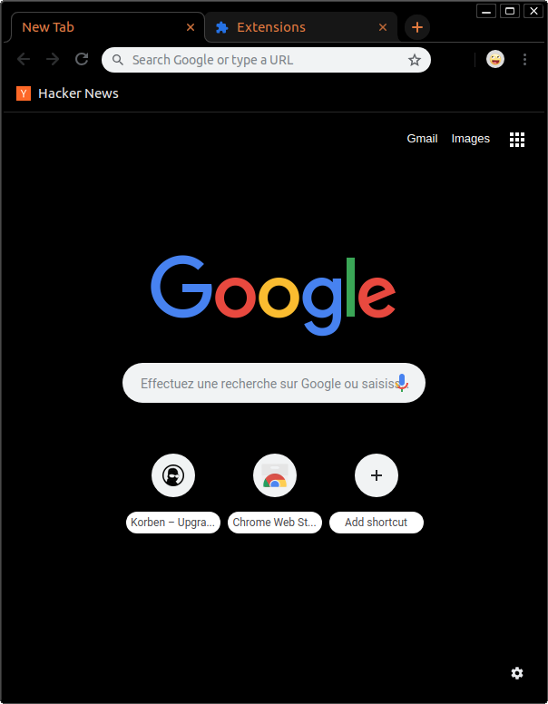

# ChromeSoberThemes

> Chrome sober themes, with multiple colors to recognize your profiles at a glance

<!-- TOC START min:2 max:4 link:true update:true -->
- [What is this?](#what-is-this)
  - [Other variations](#other-variations)
- [Why?](#why)
- [Requirements](#requirements)
- [Solution](#solution)
- [TODO list](#todo-list)
- [Want to fiddle with it?](#want-to-fiddle-with-it)

<!-- TOC END -->

## What is this?

This is a repository containing the source code for the creation of the sober dark Chrome themes.

They look like this:

### Other variations

* [Red](./docs/images/sober-dark-red-overview.png)
* [Green](./docs/images/sober-dark-green-overview.png)
* [Blue](./docs/images/sober-dark-blue-overview.png)
* [Yellow](./docs/images/sober-dark-yellow-overview.png)
* [Orange](./docs/images/sober-dark-orange-overview.png)
* [Purple](./docs/images/sober-dark-purple-overview.png)
* [Steel](./docs/images/sober-dark-steel-overview.png)
* [Pink](./docs/images/sober-dark-pink-overview.png)

## Why?

For people who use Chrome profiles to work with multiple environments (pro, personal, chat, sensitive, ...), it's nice to have easily recognizable profiles.

The chrome profile picture being way too small, using theme is a nice solution.

## Requirements

* sober:
  * no shading
  * no picture as background of home page
* clear: active tab must stand out
* dark: for use with the excellent [Dark reader](https://darkreader.org/) I find it's a must
* with color variations: to easily tell the profiles apart

## Solution

I got inspired by [Seti UI](https://github.com/jesseweed/seti-ui), my theme for [Atom](https://atom.io) that provides different color variations (that I shamelessly copied because I'm no designer and choosing colors is not something I should be tasked with).

I created a simple theme that looks a lot like [Morpheon dark](https://chrome.google.com/webstore/detail/morpheon-dark/mafbdhjdkjnoafhfelkjpchpaepjknad?hl=en) and added variations to change the color of the tabs text.

## TODO list

* [x]: Release to the Chrome store
* [ ]: Write release script
* [ ]: Automatize the release process

## Want to fiddle with it?

You can build the themes to `./dist` with `npm run build`.

Then you can try it by:

* opening `chrome://extensions`
* checking the box `Developer mode`
* selecting `Load unpacked extension`
* selecting one of the variations folder in `./dist`
* validating the choice

Chrome's doc on themes is [here](https://developer.chrome.com/extensions/themes).
