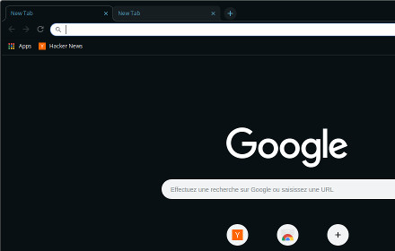

# sober-browser-themes

> Sober browser themes, with multiple colors to recognize your profiles at a glance

<!-- TOC START min:2 max:4 link:true update:true -->

* [What is this?](#what-is-this)

  * [All variations](#all-variations)

* [Browser requirements](#browser-requirements)

* [Why?](#why)

* [Requirements](#requirements)

* [Solution](#solution)

* [TODO list](#todo-list)

* [Want to fiddle with it?](#want-to-fiddle-with-it)

  * [Firefox](#firefox)
  * [Chrome](#chrome)

<!-- TOC END -->

## What is this?

This is a repository containing the source code for the creation of the sober dark themes, for Firefox and Chrome.

They look like this:

### All variations

| Color                                            | Firefox Screenshot | Firefox install link                                                        | Chrome Screenshot                                        | Chrome install link                                                                                    |
| ------------------------------------------------ | ------------------ | --------------------------------------------------------------------------- | -------------------------------------------------------- | ------------------------------------------------------------------------------------------------------ |
| Red |                    | [:link:](https://addons.mozilla.org/en-US/firefox/addon/sober-dark-red/)    | [:camera:](./docs/images/sober-dark-red-overview.png)    | [:link:](https://chrome.google.com/webstore/detail/sober-dark-red/gfgeiigojblecjnfnldmmllcgcehjnbn)    |
| Green                                            |                    | [:link:](https://addons.mozilla.org/en-US/firefox/addon/sober-dark-green/)  | [:camera:](./docs/images/sober-dark-green-overview.png)  | [:link:](https://chrome.google.com/webstore/detail/sober-dark-green/necamokhombbnmeppbamhpehidknemmn)  |
| Blue                                             |                    | [:link:](https://addons.mozilla.org/en-US/firefox/addon/sober-dark-blue/)   | [:camera:](./docs/images/sober-dark-blue-overview.png)   | [:link:](https://chrome.google.com/webstore/detail/sober-dark-blue/enmlfpdgmgdklooblhdiebljnoappppd)   |
| Yellow                                           |                    | [:link:](https://addons.mozilla.org/en-US/firefox/addon/sober-dark-yellow/) | [:camera:](./docs/images/sober-dark-yellow-overview.png) | [:link:](https://chrome.google.com/webstore/detail/sober-dark-yellow/ccpeaemokpnhbakiakpagpfbdciippgd) |
| Orange                                           |                    | [:link:](https://addons.mozilla.org/en-US/firefox/addon/sober-dark-orange/) | [:camera:](./docs/images/sober-dark-orange-overview.png) | [:link:](https://chrome.google.com/webstore/detail/sober-dark-orange/edlmpfoknljlbkacifdhobhfkpkmimoj) |
| Purple                                           |                    | [:link:](https://addons.mozilla.org/en-US/firefox/addon/sober-dark-purple/) | [:camera:](./docs/images/sober-dark-purple-overview.png) | [:link:](https://chrome.google.com/webstore/detail/sober-dark-purple/kccbjmbbfhipiopncjjbmcbcmeedbhmp) |
| Steel                                            |                    | [:link:](https://addons.mozilla.org/en-US/firefox/addon/sober-dark-steel/)  | [:camera:](./docs/images/sober-dark-steel-overview.png)  | [:link:](https://chrome.google.com/webstore/detail/sober-dark-steel/gpdhdegbjmloegcnmkjniljppajbnmdk)  |
| Pink                                             |                    | [:link:](https://addons.mozilla.org/en-US/firefox/addon/sober-dark-pink/)   | [:camera:](./docs/images/sober-dark-pink-overview.png)   | [:link:](https://chrome.google.com/webstore/detail/sober-dark-pink/agnmpjjinbbjkkfndiokoiilgbklleon)   |

## Browser requirements

Developed and tested on Ubuntu and:

* Firefox version 69
* Chrome version 77

There are no guarantees that it looks good in earlier versions.

## Why?

For people who use browser profiles to work with multiple environments (pro, personal, chat, sensitive, ...), it's nice to have easily recognizable profiles.

## Requirements

* sober:
  * no shading
  * no picture as background of home page
* clear: active tab must stand out
* dark: for use with the excellent [Dark reader](https://darkreader.org/) I find it's a must
* with color variations: to easily tell the profiles apart

## Solution

I got inspired by [Seti UI](https://github.com/jesseweed/seti-ui), my theme for [Atom](https://atom.io) that provides different color variations (that I shamelessly copied because I'm no designer and choosing colors is not something I should be tasked with).

I created a simple theme that looks a lot like [Morpheon dark](https://chrome.google.com/webstore/detail/morpheon-dark/mafbdhjdkjnoafhfelkjpchpaepjknad?hl=en) and added variations to change the color of the tabs text.

## TODO list

* [x]&#x3A; Release to the Chrome store
* [x]&#x3A; Release to Firefox's AMO
* [x]&#x3A; Write release script - take screenshots (part I Chrome)!
* [ ]&#x3A; Write release script - take screenshots (part II FF)!
* [ ]&#x3A; Automatize the release process (push to stores)

## Want to fiddle with it?

You can build the themes to `./dist` with `npm run build`.

Then you can install them that way.

### Firefox

* Open [the debugging page](about:debugging#/runtime/this-firefox)
* Click on `Load Temporary Add-on...`
* Select the file `./dist/firefox-sober-{color}-theme/manifest.json`
* Click on `Reload` each time you change the theme

Checkout [Firefox's documentation on themes](https://developer.mozilla.org/en-US/docs/Mozilla/Add-ons/WebExtensions/manifest.json/theme).

### Chrome

* Open [the Chrome extensions page](chrome://extensions)
* Check the box `Developer mode`
* Select `Load unpacked extension`
* Select one of the variations folder in `./dist/chrome-sober-{color}-theme`
* Validate the choice

Checkout [Chrome's doc on themes](https://developer.chrome.com/extensions/themes).
